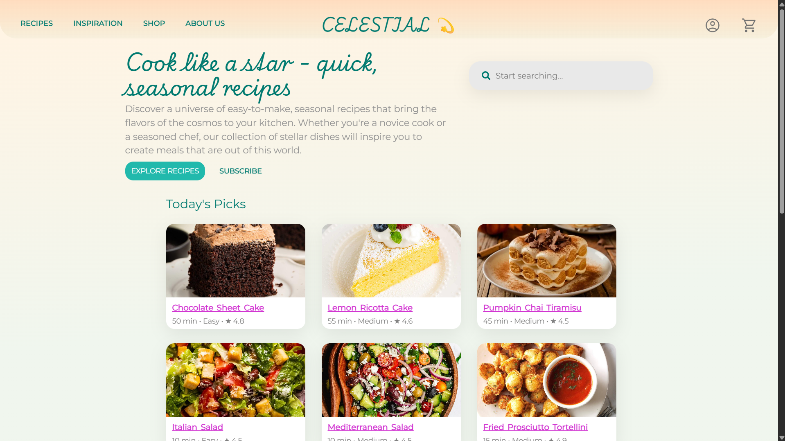
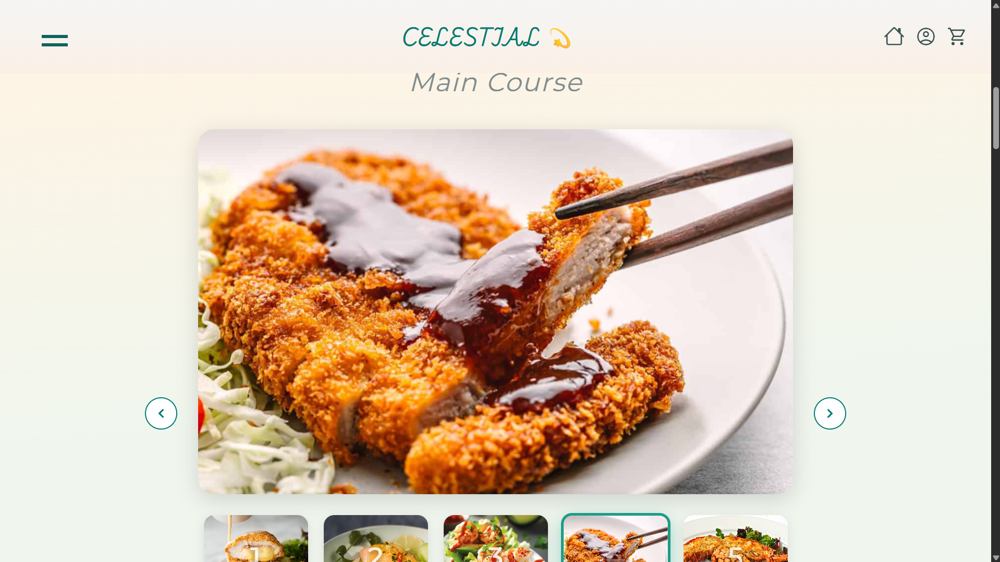
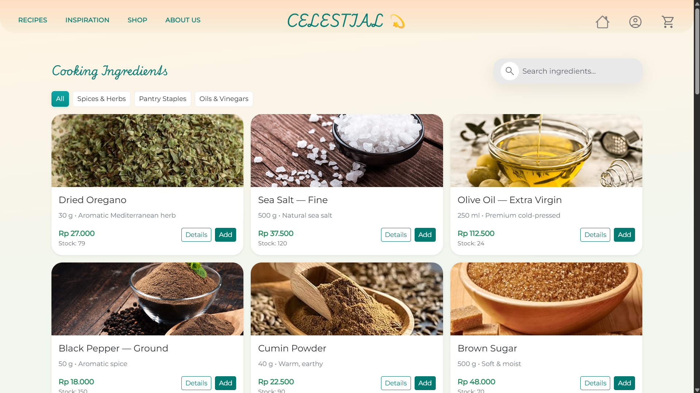
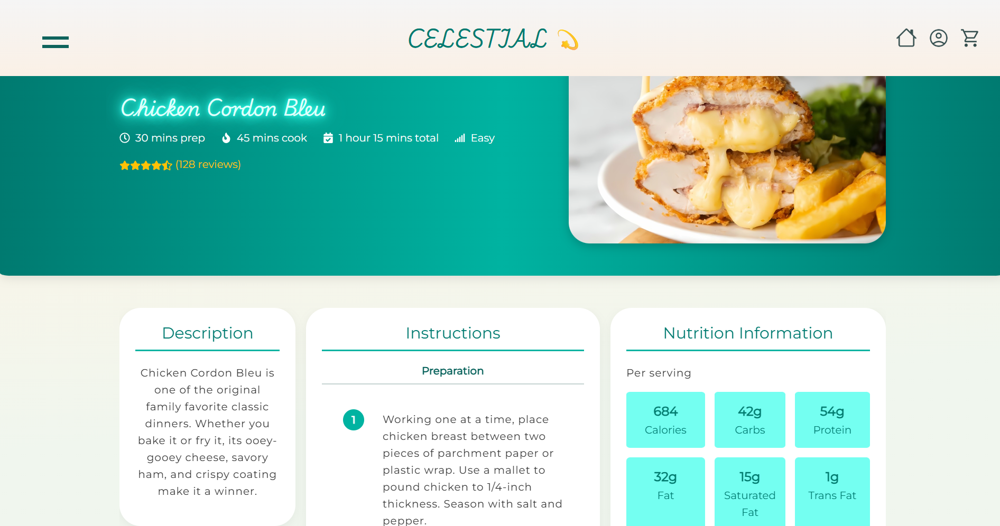
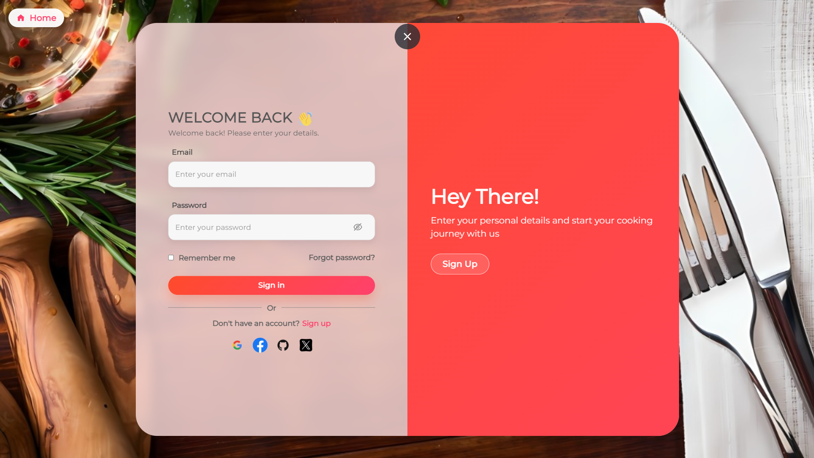
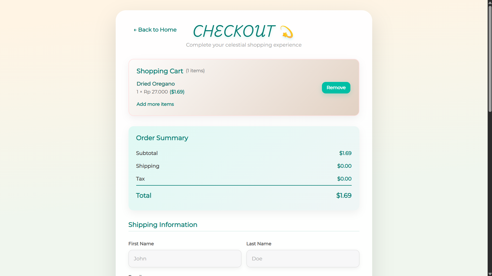
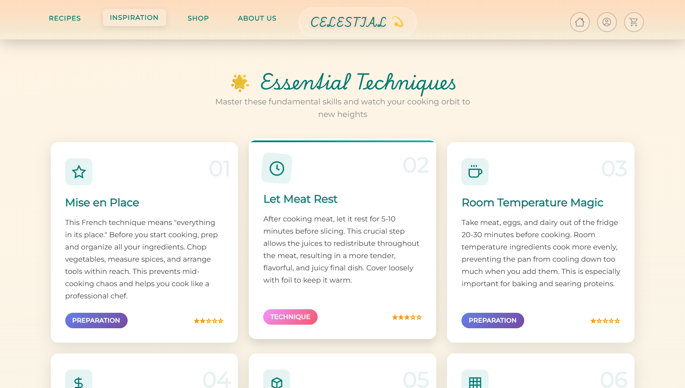
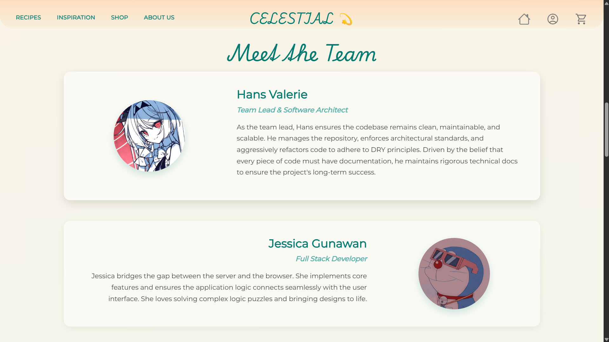

<div align="center">

  EN <!-- | [中文](./docs/readmeCN.md) -->

</div>

<p align="center">
  
  
  
  
  
  
  
</p>

<div align="center">

# 🍽️ Food Recipe Website (React)

</div>

A modern **React**-based food & recipe website with authentication, recipe browsing, shop pages, and inspirational content.  
This is an **improved, fully dynamic version** of my original static Food Recipe Website.

Live demo: **[Food Recipe Website](https://food-recipe-website-react.vercel.app/)**

---

## ✨ Features

- 🍲 **Recipe Browsing** – Dedicated `recipes` pages for exploring dishes.
- 🛒 **Shop Experience** – Product cards and detail modals in the `shop` section.
- 🔐 **Authentication Screens** – Login/registration–style pages under `authentication/` with front‑end validation.
- 💡 **Content Pages** – `home`, `about-us`, `inspiration`, `coming-soon`, and `payment` pages for a full website feel.
- ✅ **Form Validation** – Centralized auth validation in `validator/AuthValidator.jsx` and `AuthValidator.css`.
- 📱 **Responsive Layout** – Built with reusable components and CSS for desktop, tablet, and mobile.
- 🧱 **Component-Based Architecture** – Organized `components/` for navigation, loaders, footers, modals, and shop UI.
- 🧪 **Testing Setup** – Ready-to-use Jest + React Testing Library via Create React App.

---

## 🖼️ Screenshots

| | |
| :---: | :---: |
| **Home Page** | **Recipes Main Page** |
|  |  | 
| **Shopping Page** | **Recipes Page** |
|  |  |
| **Authentication Page** | **Payment Page** |
|  |  |
| **Inspiration Page** | **About Us Page** |
|  |  |

---

## 🏗️ Project Structure

```bash
Food-Recipe-Website-React/
├── public/                         # Static assets (index.html, favicon, etc.)
│
├── src/
│   ├── components/
│   │   ├── footer/                 # Footer components
│   │   ├── loader/                 # Loading indicators / skeletons
│   │   ├── modals/                 # Generic modal components
│   │   ├── navigations/            # Navbar / navigation UI
│   │   └── shop/                   # Shop-specific components
│   │
│   ├── utils/                      # Shared utilities / helpers
│   │
│   ├── validator/
│   │   ├── AuthValidator.css       # Styles for auth validation
│   │   └── AuthValidator.jsx       # Auth validation logic / components
│   │
│   ├── pages/
│   │   ├── about-us/               # About page
│   │   ├── authentication/         # Login / register pages
│   │   ├── coming-soon/            # Coming soon page
│   │   ├── home/                   # Landing / home page
│   │   ├── inspiration/            # Inspiration / content page
│   │   ├── payment/                # Payment / checkout experience
│   │   ├── recipes/                # Recipe listing / detail pages
│   │   └── shop/                   # Shop main page
│   │
│   ├── App.css                     # Global app styles
│   ├── App.js                      # Root component
│   ├── App.test.js                 # Tests for App component
│   ├─ index.css                    # Global CSS / reset
│   ├── index.js                    # ReactDOM entry point
│   ├── logo.svg                    # Logo asset
│   ├── reportWebVitals.js          # Web vitals reporting (CRA default)
│   ├── routes.js                   # Route configuration using React Router
│   └── setupTests.js               # Jest / RTL test setup
│
├── .gitignore
├── LICENSE
├── package-lock.json
├── package.json
└── README.md
```

---

## 🧰 Tech Stack

- **Framework:** React 18 (`react`, `react-dom`)
- **Routing:** React Router v6 (`react-router-dom`)
- **Styling:** Plain CSS (`App.css`, `index.css`, per-feature CSS like `AuthValidator.css`)
- **Icons:** `react-icons`
- **Tooling:** Create React App (`react-scripts`)
- **Testing:** Jest + React Testing Library  
  (`@testing-library/react`, `@testing-library/jest-dom`, `@testing-library/user-event`, `@testing-library/dom`)
- **Performance:** `web-vitals` (optional reporting)

---

## 🚀 Getting Started

### 1️⃣ Clone the repository

```bash
git clone https://github.com/Dendroculus/Food-Recipe-Website-React.git
cd Food-Recipe-Website-React
```

### 2️⃣ Install dependencies

Using **npm** (recommended with CRA):

```bash
npm install
```

> You’ll see dependencies such as `react`, `react-scripts`, `react-router-dom`, `react-icons`, `@testing-library/*`, etc., as defined in `package.json`.

### 3️⃣ Start the development server

```bash
npm start
```

This runs the app in development mode at:  
`http://localhost:3000`

The page reloads automatically when you edit files, and lint errors appear in the console.

---

## ▶️ Available Scripts

From the project root, you can run:

```bash
# Start development server
npm start

# Build production bundle
npm run build

# Run tests in watch mode
npm test

# Eject configuration (not reversible)
npm run eject
```

- `npm start` – Uses **Create React App**’s dev server via `react-scripts start`.
- `npm run build` – Builds the app for production to the `build` folder.
- `npm test` – Launches the test runner in interactive watch mode.
- `npm run eject` – Exposes the underlying Webpack/Babel config (only if you really need to customize heavily).

---

## 🌐 Deployment

The project is deployed on **Vercel**:

- **Live Site:** [Food Recipe Website](https://food-recipe-website-react.vercel.app/)

To deploy your own version:

1. Push your repository to GitHub.
2. Log in to [Vercel](https://vercel.com/) and click **“New Project”**.
3. Import this GitHub repo.
4. Vercel will auto-detect Create React App and use `npm run build` as the build command.
5. Click **Deploy**.
6. Every push to the default branch triggers a new deployment.

---

## 💡 Improvements Over the Original Static Version

This project is an improved version of the original static Food Recipe Website:

- Migrated from **static HTML/CSS/JS** to a **React SPA**.
- Centralized **routing** in `routes.js` with React Router v6.
- Added dedicated **auth**, **shop**, **recipes**, **payment**, and **inspiration** pages.
- Introduced **modal-based UX** for shop interactions (`ShopAddModal`, `ShopDetailsModal`).
- Centralized **auth validation** logic for cleaner forms.
- Prepared for tests with Jest + React Testing Library out of the box.
- Easier to integrate backend APIs or state management in the future.

---

## 🤝 Contributing

Contributions, ideas, and feedback are welcome!

1. Fork the repository.
2. Create a new branch:  
   ```bash
   git checkout -b feature/your-feature-name
   ```
3. Make your changes and commit:  
   ```bash
   git commit -m "Add some feature"
   ```
4. Push the branch:  
   ```bash
   git push origin feature/your-feature-name
   ```
5. Open a Pull Request to this repo.

For larger features or refactors, consider opening an issue first to discuss the approach.

---

## 📜 License

This project is licensed under the **MIT License**.  
See the [`LICENSE`](./LICENSE) file for details.

---
